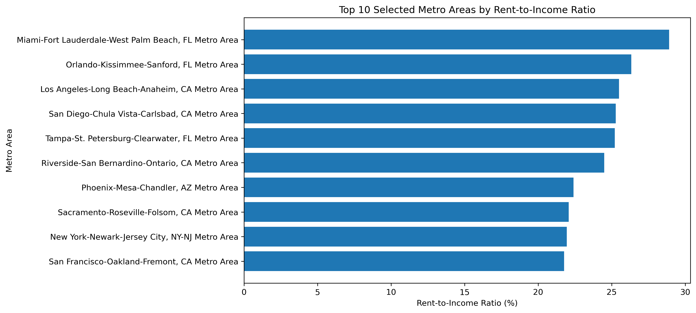
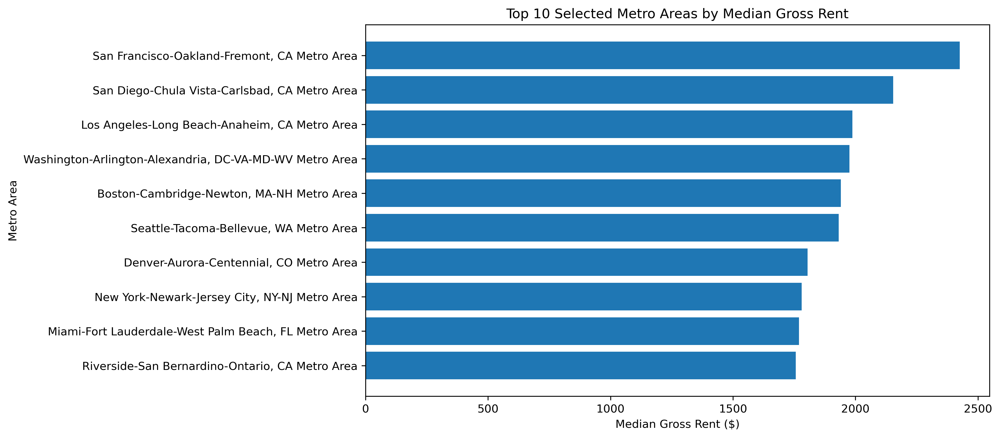
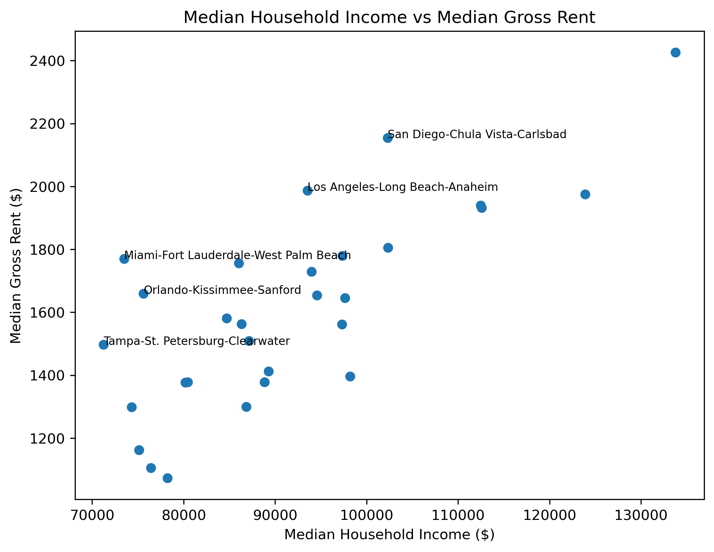

# Housing Affordability Analysis Across U.S. Metro Areas

## Overview

This project analyzes housing affordability across selected major U.S. Metro Areas using data from the U.S. Census ACS 5-Year dataset.

The goal is to compare rental housing burden by looking at both median household income and median gross rent. Instead of analyzing rent prices alone, this project uses the rent-to-income ratio to understand how much of a household's monthly income is spent on rent.

## Project Question

Which major U.S. Metro Areas have the highest rental housing burden when rent is compared to household income?

Additional questions:

- Are high-rent Metro Areas always the least affordable?
- Do higher-income Metro Areas have lower rent burden?
- How does rent-to-income ratio differ across major rental markets?

## Data Source

The data comes from the U.S. Census ACS 5-Year dataset.

Main variables used:

- `B19013_001E`: Median Household Income
- `B25064_001E`: Median Gross Rent

The analysis uses Metro Area-level data from the Census API.

## Project Structure

```text
housing-affordability-analysis/
├── README.md
├── requirements.txt
├── .gitignore
├── notebooks/
│   └── Housing-affordability-analysis.ipynb
├── data/
│   └── selected_metro_housing_affordability.csv
└── visuals/
    ├── rent_to_income_top10.png
    ├── median_gross_rent_top10.png
    └── income_vs_rent_scatter.png
```

## Methodology

The project calculates the following metrics:

```text
Monthly Income = Median Household Income / 12
Rent-to-Income Ratio = Median Gross Rent / Monthly Income
```

The rent-to-income ratio is used to compare rental housing burden across Metro Areas.

## Visualizations

### Rent-to-Income Ratio Top 10

This chart shows which selected Metro Areas have the highest rent burden when rent is compared to local household income.



### Median Gross Rent Top 10

This chart shows which selected Metro Areas have the highest median gross rent.



### Median Household Income vs Median Gross Rent

This scatter plot compares income and rent directly across the selected Metro Areas.



## Key Findings

- Among the selected 29 Metro Areas, Miami-Fort Lauderdale-West Palm Beach had the highest rent-to-income ratio.

- Several Florida and California Metro Areas appeared among the highest rent-burden markets in the selected sample.

- High rent alone does not fully explain housing affordability.

- Comparing rent with income provides a clearer view of rental market pressure.

- None of the selected 29 Metro Areas exceeded the 30% cost-burden threshold when using median household income and median gross rent.

- Median-based analysis may hide the housing burden experienced by lower-income renters.

## Limitations

This project uses median household income and median gross rent, which provide a useful overall picture of each Metro Area.

However, median values do not fully represent all renter experiences. Lower-income renters, students, and households with unstable income may face much higher housing burden than the median numbers suggest.

This project also focuses on 29 selected Metro Areas, so the results should not be interpreted as a full ranking of all U.S. housing markets.

## Future Improvements

Future versions of this project could include:

- More Metro Areas

- Poverty rate

- Median home value

- Renter household income instead of general household income

- Year-over-year affordability trends

- Map-based visualization

- A focused analysis on Wisconsin or Madison

## How to Run

1. Clone this repository.

```bash
git clone https://github.com/Dongwoon1d/housing-affordability-analysis.git
cd housing-affordability-analysis
```

2. Install the required packages.

```bash
pip install -r requirements.txt
```

3. Open the notebook in Jupyter Notebook or JupyterLab.

```text
notebooks/Housing-affordability-analysis.ipynb
```

4. Replace the placeholder Census API key with your own Census API key before running the notebook.

```python
# API key removed for security.
# Replace this value with your own Census API key before running the notebook.
API_KEY = "YOUR_CENSUS_API_KEY"
```

5. Run all cells in the notebook.

The notebook will collect ACS data, calculate rent-to-income ratios, generate visualizations, and save the cleaned dataset into the `data/` folder.

## Tools Used

- Python

- Pandas

- Requests

- Matplotlib

- U.S. Census ACS API
